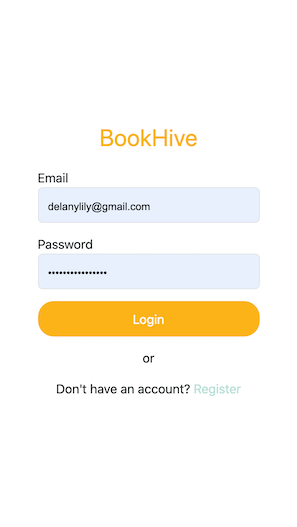
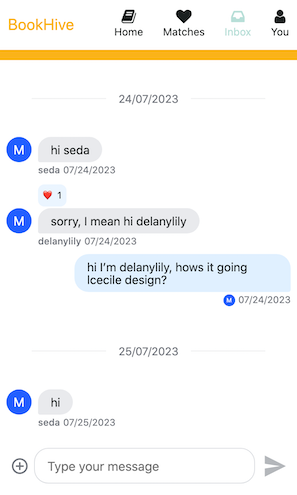

# StreamChatTest

This project was generated with [Angular CLI](https://github.com/angular/angular-cli) version 16.1.4.

## BookHive
#### Book Tinder Web Application for exchanging books
BookHive is a personal project I have worked on independently to make exhchanging books, fun, easy and cost effective!

##### Features
- Swipe to view books listed by other users, choose to request the book or save to favourties
- Inbox, live chat functionality to connect to users once a match has been made
- Google Books API implementation to easily add books to your profile, just search the title or author to easily find and post your book
- Matches will display any book match made with another user and allow you to view their collection
- Fully responsive and simple UI

##### Technologies Used
- Angular v.16.1.4
- Firebase Database, Firestore, Functions
- Stream chat
- NgRx store
- Jasmine/Karma Testing
- SCSS, LESS
- Typescript

##### Screenshots

  
  

## Development server

Run `ng serve` for a dev server. Navigate to `http://localhost:4200/`. The application will automatically reload if you change any of the source files.

## Code scaffolding

Run `ng generate component component-name` to generate a new component. You can also use `ng generate directive|pipe|service|class|guard|interface|enum|module`.

## Build

Run `ng build` to build the project. The build artifacts will be stored in the `dist/` directory.

## Running unit tests

Run `ng test` to execute the unit tests via [Karma](https://karma-runner.github.io).

## Running end-to-end tests

Run `ng e2e` to execute the end-to-end tests via a platform of your choice. To use this command, you need to first add a package that implements end-to-end testing capabilities.

## Further help

To get more help on the Angular CLI use `ng help` or go check out the [Angular CLI Overview and Command Reference](https://angular.io/cli) page.
